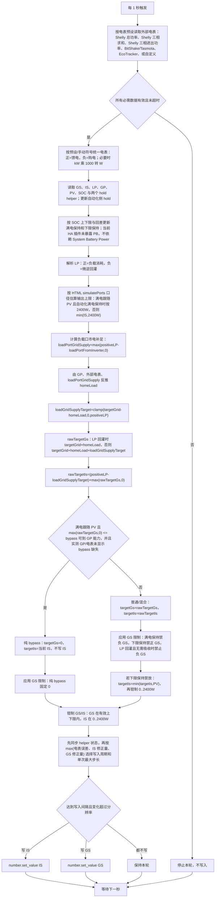

# SunEnergyXT External Meter Zero Feed-in Flow

```mermaid
flowchart TD
  A["每 1 秒触发"] --> B["按电表预设读取外部电表：Shelly 总功率、Shelly 三相求和、Shelly 三相进出功率、BitShake/Tasmota、EcoTracker、或自定义"]
  B --> C{"所有必需数据有效且未超时"}
  C -- "否" --> Z["停止本轮，不写入"]
  C -- "是" --> D["按预设/手动符号统一电表：正=馈电，负=购电；必要时 kW 乘 1000 转 W"]
  D --> E["读取 GS、IS、LP、GP、PV、SOC 与两个 hold helper；更新自动化侧 hold"]
  E --> F["按 SOC 上下限与回差更新满电保持和下限保持；当前 HA 插件未暴露 PB，不依赖 System Battery Power"]
  F --> G["解析 LP：正=负载消耗，负=微逆回灌"]
  G --> H["按 HTML simulatePorts 口径估算输出上限：满电跟随 PV 且自动化满电保持时按 2400W，否则 min(IS,2400W)"]
  H --> I["计算负载口市电补足：loadPortGridSupply=max(positiveLP-loadPortFromInverter,0)"]
  I --> J["由 GP、外部电表、loadPortGridSupply 反推 homeLoad"]
  J --> K["loadGridSupplyTarget=clamp(targetGrid-homeLoad,0,positiveLP)"]
  K --> L["rawTargetGs：LP 回灌时 targetGrid+homeLoad，否则 targetGrid+homeLoad+loadGridSupplyTarget"]
  L --> M["rawTargetIs=(positiveLP-loadGridSupplyTarget)+max(rawTargetGs,0)"]
  M --> N{"满电跟随 PV 且 max(rawTargetGs,0) <= bypass 可到 GP 能力，并且实测 GP/电表未显示 bypass 缺失"}
  N -- "是" --> O["纯 bypass：targetGs=0，targetIs=当前 IS，不写 IS"]
  N -- "否" --> P["普通/混合：targetGs=rawTargetGs，targetIs=rawTargetIs"]
  O --> Q["应用 GS 限制：纯 bypass 固定 0"]
  P --> R["应用 GS 限制：满电保持禁负 GS，下限保持禁正 GS，LP 回灌且无需吸收时禁止负 GS"]
  Q --> S["钳制 GS/IS：GS 在有效上下限内，IS 在 0..2400W"]
  R --> T["若下限保持禁放：targetIs=min(targetIs,PV)，再钳制 0..2400W"]
  T --> S
  S --> U["先同步 helper 状态，再按 max(电表误差、IS 修正量、GS 修正量) 选择写入周期和单次最大步长"]
  U --> V{"达到写入间隔且变化超过分辨率"}
  V -- "写 IS" --> W["number.set_value IS"]
  V -- "写 GS" --> X["number.set_value GS"]
  V -- "都不写" --> Y["保持本轮"]
  W --> AA["等待下一秒"]
  X --> AA
  Y --> AA
  Z --> AA
```
